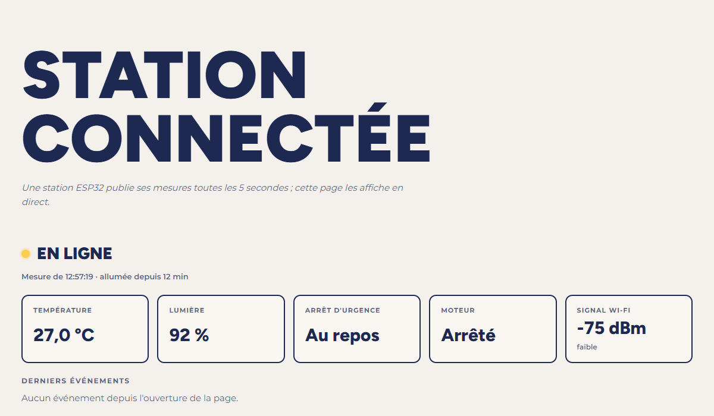
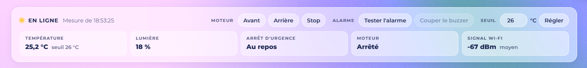
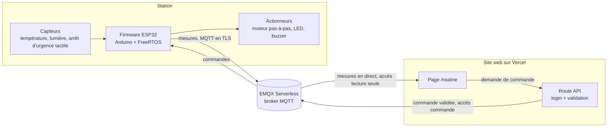

# routine-station

[English version](README.md)

Une station de supervision connectée : un ESP32 lit des capteurs, pilote un
moteur pas-à-pas et envoie ses mesures à un broker MQTT dans le cloud, pendant
qu'une page web les affiche en direct et renvoie des ordres. Quand on touche
l'arrêt d'urgence, l'alarme et l'arrêt du moteur sont gérés sur la carte en
temps réel, avec ou sans réseau.

**État :** étape 5 sur 6 terminée (la station est en direct sur le site et
reçoit ses ordres). Voir la [feuille de route](#feuille-de-route).

## Démo

La station en direct : [matthias-germain.vercel.app/routine](https://matthias-germain.vercel.app/routine)
(vue publique, en lecture seule ; [en anglais](https://matthias-germain.vercel.app/en/routine)).



La vue propriétaire, derrière un mot de passe, y ajoute les commandes (étape 5) :



_Le GIF de démo arrive à l'étape 6._

## Architecture

Architecture cible, construite étape par étape :



L'arrêt d'urgence tient entièrement dans le bloc Station : il n'attend jamais
le broker ni le Wi-Fi.

## Matériel

Tout vient d'un kit de démarrage Arduino UNO, plus une carte ESP32.

| Composant | Rôle |
|-----------|------|
| ESP32 DevKit V1 (ESP32-WROOM-32, 30 broches) | Microcontrôleur, Wi-Fi |
| LM35 | Température |
| Photorésistance + résistance 10 kΩ | Lumière ambiante |
| Module tactile capacitif TTP223 | Arrêt d'urgence |
| Moteur pas-à-pas 28BYJ-48 + driver ULN2003 | Moteur |
| LED, buzzer | Alarme |
| LED bleue de la carte ESP32 | Alerte de température |

Câblage broche par broche : [docs/wiring.md](docs/wiring.md).

## Fonctionnement

_Complété à l'étape 6._ Pour l'instant :

- Le firmware échantillonne les capteurs, pilote le moteur et publie les mesures
  en MQTT. Une alerte de température, dont le seuil se règle depuis le web,
  allume la LED bleue de la carte.
- La page `/routine` s'abonne à ces mesures avec un utilisateur MQTT en
  lecture seule et les affiche en direct (étape 4).
- Les commandes (faire tourner ou arrêter le moteur, tester l'alarme, couper son
  buzzer, régler le seuil de température) partent de boutons de la vue
  propriétaire, passent par une route API côté serveur protégée par la session
  du propriétaire, puis par le broker, jusqu'à l'ESP32. La station les vérifie à
  nouveau et répond ; la page rapproche chaque réponse de sa commande (étape 5).

Les topics MQTT et les messages JSON sont spécifiés dans
[docs/protocol.md](docs/protocol.md) (rempli à l'étape 3). C'est la référence
commune avec le dépôt du site.

## Choix techniques

Une note courte par décision importante, dans
[docs/decisions/](docs/decisions/) :

- [0001 : PlatformIO et le framework Arduino](docs/decisions/0001-platformio-arduino.md)
- [0002 : un pilote maison pour le moteur pas-à-pas](docs/decisions/0002-pilote-moteur-maison.md)
- [0003 : l'alarme flamme dans une tâche FreeRTOS](docs/decisions/0003-alarme-tache-freertos.md)
- [0004 : distinguer une flamme de la lumière du jour](docs/decisions/0004-flamme-ou-lumiere-du-jour.md),
  remplacée par la 0008
- [0005 : EMQX Serverless comme broker MQTT](docs/decisions/0005-broker-emqx.md)
- [0006 : PubSubClient comme client MQTT](docs/decisions/0006-pubsubclient.md)
- [0007 : le moteur dans sa propre tâche FreeRTOS](docs/decisions/0007-moteur-tache-freertos.md)
- [0008 : un arrêt d'urgence tactile à la place du capteur de flamme](docs/decisions/0008-arret-urgence-tactile.md)
- [0009 : la session par mot de passe protège aussi les commandes](docs/decisions/0009-session-mot-de-passe-commandes.md)

## Garanties temps réel

L'alarme tourne dans sa propre tâche FreeRTOS, de priorité plus haute que la
tâche du moteur et que `loop()`. Le module tactile a une sortie numérique : un
toucher déclenche une interruption matérielle qui réveille la tâche, et
celle-ci allume la LED et le buzzer et bloque le moteur sans passer par
`loop()`. L'arrêt d'urgence reste ensuite verrouillé jusqu'à un appui de 2 s
sur le module lui-même : aucune commande depuis le web ne peut le réarmer. Un
chien de garde redémarre la carte si la tâche s'arrête.

Mesuré sur la carte, sur 11 touchers :

| Mesure | Résultat |
|--------|----------|
| Interruption → LED, buzzer et moteur bloqué | 54 µs en médiane, de 15 à 86 µs |
| Idem, avec `loop()` bloquée 500 ms à chaque tour | 54 µs ; `loop()` elle-même n'a vu l'alarme que 388 ms plus tard |
| Idem, pendant une coupure réseau | 53 µs ; six autres touchers traités pendant 4 min 30 sans Wi-Fi |
| Commandes pendant un arrêt d'urgence | `motor start` et `alarm test` refusées, `silence` coupe seulement le buzzer |

Le module tactile lui-même met de 60 à 220 ms à reconnaître un doigt, selon son
mode (fiche technique du TTP223, non mesuré ici) : c'est lui le maillon le plus
lent, pas le firmware.

Jusqu'à l'étape 3, l'alarme était déclenchée par un capteur de flamme
infrarouge nu. Dans une pièce éclairée par le jour, il ne distinguait pas une
flamme proche d'un retour du soleil : quatre règles de détection en deux
jours, chacune réglée en enregistrant les signaux bruts puis en les rejouant
sur PC, chacune réglant un cas et en cassant un autre. Il a été remplacé par
l'arrêt d'urgence tactile
([décision 0008](docs/decisions/0008-arret-urgence-tactile.md)). Les mesures
de la flamme et la méthode d'enregistrement et de rejeu sont dans le
[journal de l'étape 2](docs/journal/02-alarme-flamme.md).

## Modèle de sécurité

_Mis en place aux étapes 3 à 5._ La conception :

- Le broker a trois utilisateurs, chacun limité à ses propres topics : la
  station (étape 3), un en lecture seule utilisé par la page publique (étape 4),
  et un de commande utilisé uniquement par une route API côté serveur (étape 5).
- La partie propriétaire de `/routine` est derrière une session à mot de passe
  (étape 4). La même session protège la route API des commandes
  ([décision 0009](docs/decisions/0009-session-mot-de-passe-commandes.md)),
  qui vérifie aussi que la requête vient du site lui-même et valide chaque
  commande : type autorisé, valeurs dans les bornes. Elle publie avec
  l'utilisateur de commande, qui ne peut publier que sur le topic des
  commandes.
- Ni double authentification ni limite de tentatives : la sécurité physique
  reste sur la carte. L'arrêt d'urgence ne se réarme que sur place, et le moteur
  est refusé pendant une alarme, quoi que le site envoie.
- L'ESP32 valide à nouveau chaque commande et communique avec le broker en TLS.
- Aucun secret n'est commité : le vrai fichier de configuration est ignoré par
  git et un fichier exemple est commité à sa place.

## Feuille de route

- [x] **Étape 0, mise en place** : structure du dépôt, PlatformIO, README
  squelette, conventions (`v0.0-setup`)
- [x] **Étape 1, capteurs et moteur en local** : tout fonctionne, résultats dans
  le moniteur série (`v0.1-sensors`)
- [x] **Étape 2, alarme temps réel** : tâche dédiée à haute priorité, temps de
  réaction mesuré (`v0.2-alarm`) ; d'abord déclenchée par un capteur de
  flamme, remplacé après l'étape 3 par un arrêt d'urgence tactile
- [x] **Étape 3, broker cloud** : Wi-Fi, MQTT en TLS, reconnexion automatique,
  envoi des mesures, réception des commandes (`v0.3-mqtt`)
- [x] **Étape 4, page `/routine` en direct** : dans le dépôt du site ; la
  station en direct dans une vue publique en lecture seule, le tableau de bord
  du propriétaire derrière un mot de passe (`v0.4-live-page`)
- [x] **Étape 5, commandes depuis le web** : moteur, alarme et seuil de
  température depuis la vue propriétaire, via une route API protégée par la
  session à mot de passe (`v0.5-commands`)
- [ ] **Étape 6, finition** : README complet, schéma de câblage, GIF de démo,
  bilan (`v1.0`)

Le récit de chaque étape est dans [docs/journal/](docs/journal/).

## Compiler et téléverser

Nécessite [PlatformIO](https://platformio.org/) (extension VS Code ou ligne de
commande).

```sh
pio run                # compiler
pio run -t upload      # téléverser sur la carte en USB
pio device monitor     # moniteur série, 115200 bauds
```

## Organisation du dépôt

```
platformio.ini     configuration de la carte et de la chaîne de compilation
include/pins.h     toutes les broches au même endroit
src/               firmware, un module par responsabilité
docs/protocol.md   topics MQTT et messages JSON
docs/wiring.md     câblage broche par broche
docs/journal/      un fichier court par étape
docs/decisions/    une note courte par choix important
```

## Ce que j'ai appris

_Rédigé à la fin du projet._

## Licence

[MIT](LICENSE)
