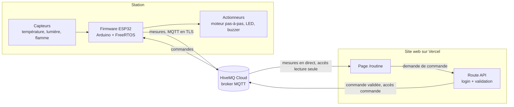

# routine-station

[English version](README.md)

Une station de supervision connectée : un ESP32 lit des capteurs, pilote un
moteur pas-à-pas et envoie ses mesures à un broker MQTT dans le cloud, pendant
qu'une page web les affiche en direct et renvoie des ordres. Quand une flamme
est détectée, l'alarme et l'arrêt du moteur sont gérés sur la carte en temps
réel, avec ou sans réseau.

**État :** étape 1 sur 6 terminée (capteurs et moteur en local). Voir la
[feuille de route](#feuille-de-route).

## Démo

_La page en ligne arrive à l'étape 4, le GIF de démo à l'étape 6._

## Architecture

Architecture cible, construite étape par étape :



L'alarme flamme tient entièrement dans le bloc Station : elle n'attend jamais le
broker ni le Wi-Fi.

## Matériel

Tout vient d'un kit de démarrage Arduino UNO, plus une carte ESP32.

| Composant | Rôle |
|-----------|------|
| ESP32 DevKit V1 (ESP32-WROOM-32, 30 broches) | Microcontrôleur, Wi-Fi |
| LM35 | Température |
| Photorésistance + résistance 10 kΩ | Lumière ambiante |
| Capteur de flamme infrarouge + résistance 10 kΩ | Détection de flamme |
| Moteur pas-à-pas 28BYJ-48 + driver ULN2003 | Moteur |
| LED, buzzer | Alarme |

Câblage broche par broche : [docs/wiring.md](docs/wiring.md).

## Fonctionnement

_Rempli au fil des étapes._ Le plan :

- Le firmware échantillonne les capteurs, pilote le moteur et publie les mesures
  en MQTT.
- La page `/routine` s'abonne à ces mesures et les affiche en direct.
- Les commandes (démarrer ou arrêter le moteur, déclencher ou couper l'alarme,
  régler des seuils) partent de la page, passent par une route API protégée,
  puis par le broker, jusqu'à l'ESP32.

Les topics MQTT et les messages JSON sont spécifiés dans
[docs/protocol.md](docs/protocol.md) (rempli à l'étape 3). C'est la référence
commune avec le dépôt du site.

## Choix techniques

Une note courte par décision importante, dans
[docs/decisions/](docs/decisions/) :

- [0001 : PlatformIO et le framework Arduino](docs/decisions/0001-platformio-arduino.md)

## Garanties temps réel

_À l'étape 2, avec le temps de réaction mesuré de l'alarme flamme._

## Modèle de sécurité

_Mis en place aux étapes 3 et 5._ La conception :

- Le broker a deux jeux d'identifiants : un en lecture seule, utilisé par la
  page publique, et un de commande, utilisé uniquement par une route API côté
  serveur.
- La route API vérifie que le propriétaire est connecté (Auth.js, connexion
  GitHub limitée à un seul compte) et valide chaque commande : type autorisé,
  valeurs dans les bornes.
- L'ESP32 valide à nouveau chaque commande et communique avec le broker en TLS.
- Aucun secret n'est commité : le vrai fichier de configuration est ignoré par
  git et un fichier exemple est commité à sa place.

## Feuille de route

- [x] **Étape 0, mise en place** : structure du dépôt, PlatformIO, README
  squelette, conventions (`v0.0-setup`)
- [x] **Étape 1, capteurs et moteur en local** : tout fonctionne, résultats dans
  le moniteur série (`v0.1-sensors`)
- [ ] **Étape 2, alarme flamme temps réel** : tâche dédiée à haute priorité,
  temps de réaction mesuré (`v0.2-alarm`)
- [ ] **Étape 3, broker cloud** : Wi-Fi, MQTT en TLS, reconnexion automatique,
  envoi des mesures, réception des commandes (`v0.3-mqtt`)
- [ ] **Étape 4, page `/routine` en direct** : dans le dépôt du site
  (`v0.4-live-page`)
- [ ] **Étape 5, commandes depuis le web** : route API protégée par login
  (`v0.5-commands`)
- [ ] **Étape 6, finition** : README complet, schéma de câblage, GIF de démo,
  bilan (`v1.0`)

Le récit de chaque étape est dans [docs/journal/](docs/journal/).

## Compiler et téléverser

Nécessite [PlatformIO](https://platformio.org/) (extension VS Code ou ligne de
commande).

```sh
pio run                # compiler
pio run -t upload      # téléverser sur la carte en USB
pio device monitor     # moniteur série, 115200 bauds
```

## Organisation du dépôt

```
platformio.ini     configuration de la carte et de la chaîne de compilation
include/pins.h     toutes les broches au même endroit
src/               firmware, un module par responsabilité
docs/protocol.md   topics MQTT et messages JSON
docs/wiring.md     câblage broche par broche
docs/journal/      un fichier court par étape
docs/decisions/    une note courte par choix important
```

## Ce que j'ai appris

_Rédigé à la fin du projet._

## Licence

[MIT](LICENSE)
