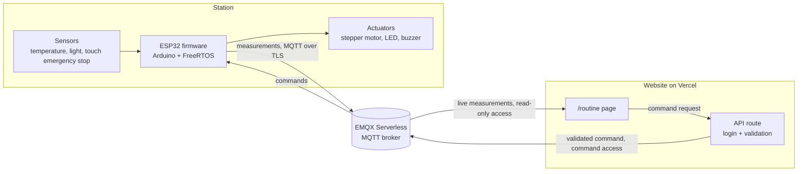

# routine-station

[Version française](README.fr.md)

A connected monitoring station: an ESP32 reads sensors, drives a stepper motor
and streams its measurements to a cloud MQTT broker, while a web page shows them
live and sends commands back. When someone touches the emergency stop, the
alarm and the motor stop are handled on the board in real time, with or without
a network.

**Status:** step 5 of 6 done (the station is live on the website and takes
commands from it). See the [roadmap](#roadmap).

## Demo

The station, live: [matthias-germain.vercel.app/routine](https://matthias-germain.vercel.app/routine)
(public, read-only view; [in English](https://matthias-germain.vercel.app/en/routine)).


The owner view, behind a password, adds the commands (step 5):


_The demo GIF arrives at step 6._

## Architecture

Target architecture, built step by step:



The emergency stop lives entirely inside the station box: it never waits for
the broker or the Wi-Fi.

## Hardware

Everything comes from an Arduino UNO starter kit plus an ESP32 board.

| Part | Role |
|------|------|
| ESP32 DevKit V1 (ESP32-WROOM-32, 30 pins) | Microcontroller, Wi-Fi |
| LM35 | Temperature |
| Photoresistor + 10 kΩ resistor | Ambient light |
| TTP223 capacitive touch module | Emergency stop |
| 28BYJ-48 stepper motor + ULN2003 driver | Motor |
| LED, buzzer | Alarm |
| Blue LED on the ESP32 board | Temperature alert |

Pin-by-pin wiring: [docs/wiring.md](docs/wiring.md) (in French).

## How it works

_Completed at step 6._ So far:

- The firmware samples the sensors, drives the motor and publishes measurements
  over MQTT. A temperature alert, with a threshold set from the web, lights the
  blue LED of the board.
- The `/routine` page subscribes to those measurements with a read-only MQTT
  user and displays them live (step 4).
- Commands (run or stop the motor, test the alarm, silence its buzzer, set the
  temperature threshold) go from buttons in the owner view, through a
  server-side API route protected by the owner's session, to the broker, then
  to the ESP32. The station checks them again and replies; the page matches the
  reply to its command (step 5).

The MQTT topics and JSON payloads are specified in
[docs/protocol.md](docs/protocol.md) (in French, filled in at step 3). It is the
shared reference with the website repository.

## Technical choices

One short note per important decision, in [docs/decisions/](docs/decisions/) (in
French):

- [0001: PlatformIO and the Arduino framework](docs/decisions/0001-platformio-arduino.md)
- [0002: a home-made stepper motor driver](docs/decisions/0002-pilote-moteur-maison.md)
- [0003: the flame alarm in a FreeRTOS task](docs/decisions/0003-alarme-tache-freertos.md)
- [0004: telling a flame from daylight](docs/decisions/0004-flamme-ou-lumiere-du-jour.md),
  replaced by 0008
- [0005: EMQX Serverless as the MQTT broker](docs/decisions/0005-broker-emqx.md)
- [0006: PubSubClient as the MQTT client](docs/decisions/0006-pubsubclient.md)
- [0007: the motor in its own FreeRTOS task](docs/decisions/0007-moteur-tache-freertos.md)
- [0008: a touch emergency stop instead of the flame sensor](docs/decisions/0008-arret-urgence-tactile.md)
- [0009: the password session also protects the commands](docs/decisions/0009-session-mot-de-passe-commandes.md)

## Real-time guarantees

The alarm runs in its own FreeRTOS task, with a higher priority than the motor
task and `loop()`. The touch module has a digital output: a touch fires a
hardware interrupt that wakes the task, which turns on the LED and the buzzer
and locks the motor without going through `loop()`. The emergency stop then
stays latched until a 2-second touch on the module itself: no command from the
web can reset it. A watchdog reboots the board if the task ever stops.

Measured on the board, over 11 touches:

| Measure | Result |
|---------|--------|
| Interrupt to LED, buzzer and motor lock | 54 µs median, 15 to 86 µs |
| Same, with `loop()` stalled 500 ms per pass | 54 µs; `loop()` itself only saw the alarm 388 ms later |
| Same, during a network outage | 53 µs; six more touches handled during 4.5 minutes without Wi-Fi |
| Commands during an emergency stop | `motor start` and `alarm test` refused, `silence` only mutes the buzzer |

The touch module itself takes 60 to 220 ms to recognize a finger, depending on
its mode (TTP223 datasheet, not measured here): it is the slowest link, not the
firmware.

Until step 3, the alarm was triggered by a bare infrared flame sensor. With
daylight in the room, it could not tell a nearby flame from the sun coming
back: four detection rules in two days, each tuned by recording raw signals
and replaying them on a PC, each fixing one case and breaking another. It was
replaced by the touch emergency stop
([decision 0008](docs/decisions/0008-arret-urgence-tactile.md)). The flame
measurements and the capture-and-replay method are in the
[step 2 journal](docs/journal/02-alarme-flamme.md) (in French).

## Security model

_Implemented at steps 3 to 5._ The design:

- The broker has three users, each restricted to its own topics: the station
  (step 3), a read-only one used by the public page (step 4), and a command one
  used only by a server-side API route (step 5).
- The owner side of `/routine` sits behind a password session (step 4). The
  same session protects the command API route
  ([decision 0009](docs/decisions/0009-session-mot-de-passe-commandes.md)),
  which also checks that the request comes from the site itself and validates
  every command: allowed type, values within bounds. It publishes with the
  command user, allowed to publish on the commands topic only.
- No two-factor login and no attempt limit: physical safety stays on the board.
  The emergency stop can only be reset on site, and the motor is refused during
  an alarm, whatever the website sends.
- The ESP32 validates every command again and talks to the broker over TLS.
- No secret is committed: the real configuration file is git-ignored and an
  example file is committed in its place.

## Roadmap

- [x] **Step 0, setup**: repository structure, PlatformIO, README skeleton,
  conventions (`v0.0-setup`)
- [x] **Step 1, local sensors and motor**: everything works, results on the
  serial monitor (`v0.1-sensors`)
- [x] **Step 2, real-time alarm**: dedicated high-priority task, measured
  reaction time (`v0.2-alarm`); first triggered by a flame sensor, replaced
  after step 3 by a touch emergency stop
- [x] **Step 3, cloud broker**: Wi-Fi, MQTT over TLS, automatic reconnection,
  measurements out, commands in (`v0.3-mqtt`)
- [x] **Step 4, live `/routine` page**: in the website repository; the
  station live in a public, read-only view, the owner dashboard behind a
  password (`v0.4-live-page`)
- [x] **Step 5, commands from the web**: motor, alarm and temperature
  threshold from the owner view, through an API route protected by the
  password session (`v0.5-commands`)
- [ ] **Step 6, polish**: complete README, wiring diagram, demo GIF, wrap-up
  (`v1.0`)

The story of each step is in [docs/journal/](docs/journal/) (in French).

## Build and flash

Requires [PlatformIO](https://platformio.org/) (VS Code extension or CLI).

```sh
pio run                # build
pio run -t upload      # flash the board over USB
pio device monitor     # serial monitor, 115200 baud
```

## Repository layout

```
platformio.ini     board and toolchain configuration
include/pins.h     every GPIO in one place
src/               firmware, one module per responsibility
docs/protocol.md   MQTT topics and JSON payloads
docs/wiring.md     pin-by-pin wiring
docs/journal/      one short entry per step
docs/decisions/    one short note per important choice
```

## What I learned

_Written at the end of the project._

## License

[MIT](LICENSE)
