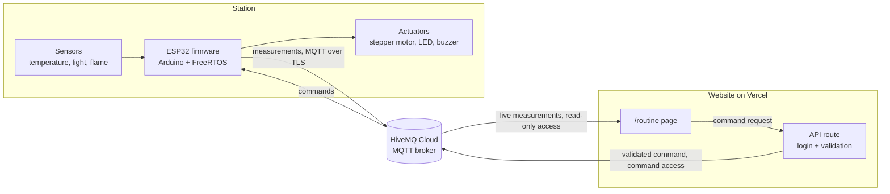

# routine-station

[Version française](README.fr.md)

A connected monitoring station: an ESP32 reads sensors, drives a stepper motor
and streams its measurements to a cloud MQTT broker, while a web page shows them
live and sends commands back. When a flame is detected, the alarm and the motor
stop are handled on the board in real time, with or without a network.

**Status:** step 0 of 6 done (repository and toolchain). See the
[roadmap](#roadmap).

## Demo

_The live page arrives at step 4, the demo GIF at step 6._

## Architecture

Target architecture, built step by step:



The flame alarm lives entirely inside the station box: it never waits for the
broker or the Wi-Fi.

## Hardware

Everything comes from an Arduino UNO starter kit plus an ESP32 board.

| Part | Role |
|------|------|
| ESP32 DevKit V1 (ESP32-WROOM-32, 30 pins) | Microcontroller, Wi-Fi |
| LM35 | Temperature |
| Photoresistor | Ambient light |
| Flame sensor module | Flame detection |
| 28BYJ-48 stepper motor + ULN2003 driver | Motor |
| LED, buzzer | Alarm |

Pin-by-pin wiring: [docs/wiring.md](docs/wiring.md) (in French, filled in from
step 1).

## How it works

_Filled in as the steps land._ The plan:

- The firmware samples the sensors, drives the motor and publishes measurements
  over MQTT.
- The `/routine` page subscribes to those measurements and displays them live.
- Commands (start or stop the motor, trigger or silence the alarm, set
  thresholds) go from the page through a protected API route to the broker, then
  to the ESP32.

The MQTT topics and JSON payloads are specified in
[docs/protocol.md](docs/protocol.md) (in French, filled in at step 3). It is the
shared reference with the website repository.

## Technical choices

One short note per important decision, in [docs/decisions/](docs/decisions/) (in
French):

- [0001: PlatformIO and the Arduino framework](docs/decisions/0001-platformio-arduino.md)

## Real-time guarantees

_Coming at step 2, with the measured reaction time of the flame alarm._

## Security model

_Implemented at steps 3 and 5._ The design:

- The broker has two sets of credentials: a read-only one used by the public
  page, and a command one used only by a server-side API route.
- The API route checks that the owner is logged in (Auth.js, GitHub login
  restricted to one account) and validates every command: allowed type, values
  within bounds.
- The ESP32 validates every command again and talks to the broker over TLS.
- No secret is committed: the real configuration file is git-ignored and an
  example file is committed in its place.

## Roadmap

- [x] **Step 0, setup**: repository structure, PlatformIO, README skeleton,
  conventions (`v0.0-setup`)
- [ ] **Step 1, local sensors and motor**: everything works, results on the
  serial monitor (`v0.1-sensors`)
- [ ] **Step 2, real-time flame alarm**: dedicated high-priority task, measured
  reaction time (`v0.2-alarm`)
- [ ] **Step 3, cloud broker**: Wi-Fi, MQTT over TLS, automatic reconnection,
  measurements out, commands in (`v0.3-mqtt`)
- [ ] **Step 4, live `/routine` page**: in the website repository
  (`v0.4-live-page`)
- [ ] **Step 5, commands from the web**: API route protected by login
  (`v0.5-commands`)
- [ ] **Step 6, polish**: complete README, wiring diagram, demo GIF, wrap-up
  (`v1.0`)

The story of each step is in [docs/journal/](docs/journal/) (in French).

## Build and flash

Requires [PlatformIO](https://platformio.org/) (VS Code extension or CLI).

```sh
pio run                # build
pio run -t upload      # flash the board over USB
pio device monitor     # serial monitor, 115200 baud
```

## Repository layout

```
platformio.ini     board and toolchain configuration
include/pins.h     every GPIO in one place
src/               firmware, one module per responsibility
docs/protocol.md   MQTT topics and JSON payloads
docs/wiring.md     pin-by-pin wiring
docs/journal/      one short entry per step
docs/decisions/    one short note per important choice
```

## What I learned

_Written at the end of the project._

## License

[MIT](LICENSE)
