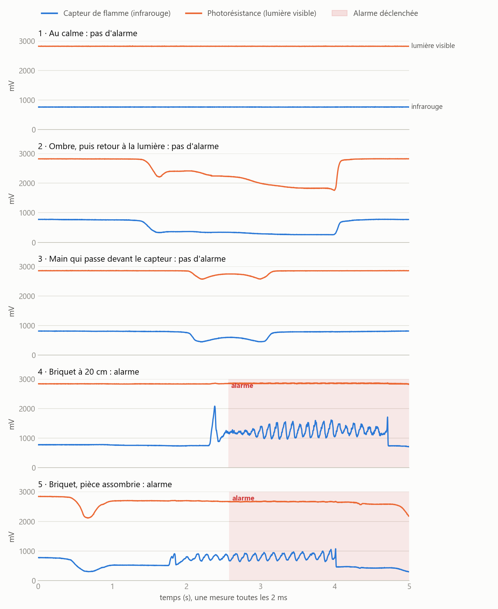
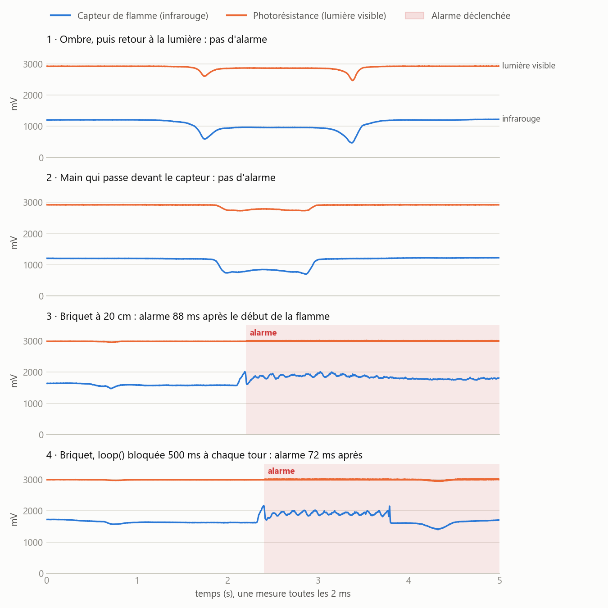

# Étape 2 : alarme flamme temps réel

- **Date** : 2026-10-08
- **Tag** : `v0.2-alarm`

## Objectif

Dès qu'une flamme apparaît, allumer la LED et le buzzer et arrêter le moteur en
quelques dizaines de millisecondes, **quoi que fasse le reste du programme**. À
partir de l'étape 3, `loop()` attendra le réseau, parfois plusieurs secondes :
l'alarme ne doit pas en dépendre. Et mesurer ce temps de réaction.

## Ce qui a été fait

- **Câblage** : LED rouge sur D26 avec 220 Ω, buzzer actif directement sur D27
  (le kit n'a pas de transistor ; testé, le buzzer sonne assez fort en 3,3 V).
  Voir [`docs/wiring.md`](../wiring.md).
- **`src/alarm`** : une tâche FreeRTOS dédiée
  ([décision 0003](../decisions/0003-alarme-tache-freertos.md)) :
  - priorité 10, au-dessus de `loop()` (1), épinglée sur le cœur 1 ;
  - lecture du capteur de flamme et de la photorésistance toutes les 2 ms ;
  - surveillée par le chien de garde : si elle se bloque 5 s, la carte
    redémarre ;
  - elle n'écrit jamais sur le port série : ses événements passent par une file
    FreeRTOS que `loop()` affiche.
- **`src/motor`** : l'état du moteur est protégé par une section critique, pour
  que l'alarme puisse l'arrêter au milieu d'un pas lancé par `loop()`, et un
  verrou empêche tout redémarrage pendant l'alarme.
- **Détection** : la photorésistance sert de référence pour reconnaître la
  lumière du jour ([décision 0004](../decisions/0004-flamme-ou-lumiere-du-jour.md)).
- **Outils de mesure**, dans le moniteur série :
  - touche `c` (`src/capture`) : enregistre 5 s de mesures brutes, toutes les
    2 ms, puis les affiche en CSV ; avec `pio device monitor -f log2file`, tout
    est sauvegardé dans `logs/` ;
  - touche `s` : bloque `loop()` 500 ms à chaque tour, comme un appel réseau
    lent, pour vérifier que l'alarme n'en dépend pas.

## Difficultés rencontrées

- **Le capteur de flamme voit la lumière du jour.** Pièce éclairée : 600 à
  2000 mV selon l'heure ; briquet à 20 cm : à peine au-dessus. Ma première
  hypothèse, le scintillement des lampes à 100 Hz, était fausse : la pièce
  n'est éclairée que par la fenêtre. C'est l'infrarouge du soleil.
- **Fausse alarme à chaque retour de la lumière.** La première version
  comparait le capteur à un niveau ambiant qui le suit lentement. Pendant une
  ombre, ce niveau baisse ; quand la lumière revient, la hausse ressemble à une
  flamme. Pire : figé pendant l'alarme, ce niveau la bloquait pour de bon si le
  jour augmentait. Il a fallu appuyer sur EN pour l'arrêter.
- **Le moteur faussait toutes les mesures.** En comparant les lignes « moteur
  arrêté » et « moteur en marche » du moniteur : la température passait de
  24,6–25,1 °C à 26,5–28,3 °C, et le capteur de flamme gagnait 40 mV. Le
  courant du moteur (environ 200 mA) revenait par le même rail GND que les
  capteurs et décalait leur masse. Un fil séparé du − de l'ULN2003 vers la
  broche GND libre de l'ESP32 a réglé le problème : la température reste entre
  23,1 et 23,9 °C, moteur en marche ou non. Ce défaut existait déjà à l'étape 1
  sans avoir été vu.
- **Choisir les réglages sans tâtonner.** Plutôt que d'ajuster les seuils à
  l'aveugle, le mode capture a enregistré les signaux bruts dans 12 situations :
  calme, ombre, main, briquet à 20 et 30 cm, pénombre, `loop()` bloquée. Ces
  captures ont ensuite été rejouées sur PC dans une copie de l'algorithme pour
  comparer les réglages. Ce que ça a montré :
  - **la flamme vacille**, environ 7 oscillations par seconde (figure 1). Avec
    une moyenne sur 10 ms et 50 mesures de suite exigées, chaque creux
    remettait le compteur à zéro : jusqu'à 780 ms de retard sur une flamme
    faible. Une moyenne sur 100 ms lisse le vacillement ;
  - **après une ombre, l'infrarouge revient plus lentement** que la lumière
    visible : avec 300 ms de pause, sa traîne atteignait encore +135 mV ; avec
    500 ms, moins de 40 mV ;
  - **le signal d'une flamme varie énormément** : de +42 mV (petite flamme à
    30 cm) à +680 mV (briquet bien pointé à 20 cm). Le seuil de 100 mV laisse
    une marge au-dessus des 40 mV mesurés sans flamme.
- **Le rejeu reproduit la carte** : sur la même capture, l'alarme part à
  2,560 s dans la simulation et à 2,562 s sur la carte.



*Figure 1 : premières captures, avec la règle de détection d'alors. La flamme
(captures 4 et 5) vacille ; l'ombre et la main donnent des courbes lisses.*

## Résultat

Compilation réussie :

```
RAM:   [==        ]  15.8% (used 51728 bytes from 327680 bytes)
Flash: [==        ]  21.4% (used 281073 bytes from 1310720 bytes)
```

La RAM passe de 6,6 % à 15,8 % : ce sont les 30 Ko du tampon de capture.

Mesures sur la carte, avec la règle finale :

| Mesure | Résultat |
|--------|----------|
| Période de la tâche d'alarme | 2,000 ms en moyenne, toujours entre 1,69 et 2,26 ms (30 000 mesures), y compris pendant que `loop()` est bloquée |
| Bruit du capteur au repos | ±2 mV |
| Réaction de la tâche (seuil franchi → LED, buzzer, moteur bloqué) | 18,0 ms : les 10 mesures de confirmation |
| De bout en bout (début de la flamme → alarme) | 88 ms ; **72 ms avec `loop()` bloquée 500 ms à chaque tour** |
| La même alarme vérifiée dans `loop()` bloquée | vue seulement après 127 ms dans l'essai, et jusqu'à 500 ms possibles |
| Fausses alarmes | aucune pendant 30 s d'ombres et de mains sur la carte, ni sur les 6 captures sans flamme rejouées avec la règle finale |
| Portée | briquet pointé vers le capteur à 20 cm ; une petite flamme à 30 cm n'est pas détectée |



*Figure 2 : règle finale. Ni l'ombre ni la main ne déclenchent ; le briquet
déclenche en 88 ms, et en 72 ms quand `loop()` est bloquée : l'alarme ne
dépend pas de `loop()`. Les captures 1 et 2 viennent de la série précédente ;
rejouées avec la règle finale, elles ne déclenchent pas non plus.*

Vérification sur la carte :

- [x] aucune alarme au calme, sur des ombres ni sur une main qui passe
- [x] briquet à 20 cm : LED et buzzer s'allument, le moteur s'arrête et passe à
  `locked`
- [x] l'alarme s'éteint 3 s après la flamme et le moteur repart
- [x] avec `loop()` bloquée (touche `s`), l'alarme réagit aussi vite
- [x] température stable, moteur en marche ou non

## Limites connues

- **Portée** : environ 20 cm en plein jour, flamme pointée vers le capteur.
- **Juste après un changement de lumière** : pendant 500 ms, une flamme qui
  apparaît est absorbée par la référence et peut passer inaperçue.
- **Pénombre** : la lumière visible n'est plus vérifiée sous 50 % ; allumer une
  ampoule à incandescence ou halogène pourrait déclencher l'alarme. Pas testé
  dans le noir complet.
- **Piste d'amélioration** : détecter le vacillement de la flamme, très net sur
  une flamme franche, permettrait d'être moins dépendant de la lumière.

## Captures

_À ajouter dans `docs/assets/` : une photo du montage avec la LED et le buzzer,
un GIF de l'alarme qui se déclenche._

## Épilogue : le capteur de flamme abandonné (2026-10-09)

Après l'étape 3, la station a tourné toute une journée près de la fenêtre, et
la règle finale n'a pas tenu : fausse alarme à chaque retour de la lumière
après une ombre de quelques secondes. Deux nouvelles règles ont suivi, rejouées
sur PC comme ici. Chacune réglait les ombres, mais laissait passer un briquet à
5 cm : de près, la flamme éclaire assez la photorésistance pour ressembler à un
retour du soleil.

Quatre règles en deux jours, sans en trouver une qui tienne : ce capteur nu ne
distingue pas une flamme proche du soleil. Il a été remplacé par un **arrêt
d'urgence tactile** (module TTP223, interruption matérielle, verrouillé jusqu'à
un appui long de 2 s), voir la
[décision 0008](../decisions/0008-arret-urgence-tactile.md). La tâche d'alarme,
les sorties et le blocage du moteur construits ici sont restés tels quels :
seul le déclencheur a changé.

Ce journal reste le récit de l'étape telle qu'elle a été menée. Le code du
capteur de flamme et du mode capture est au tag `v0.3-mqtt`.
