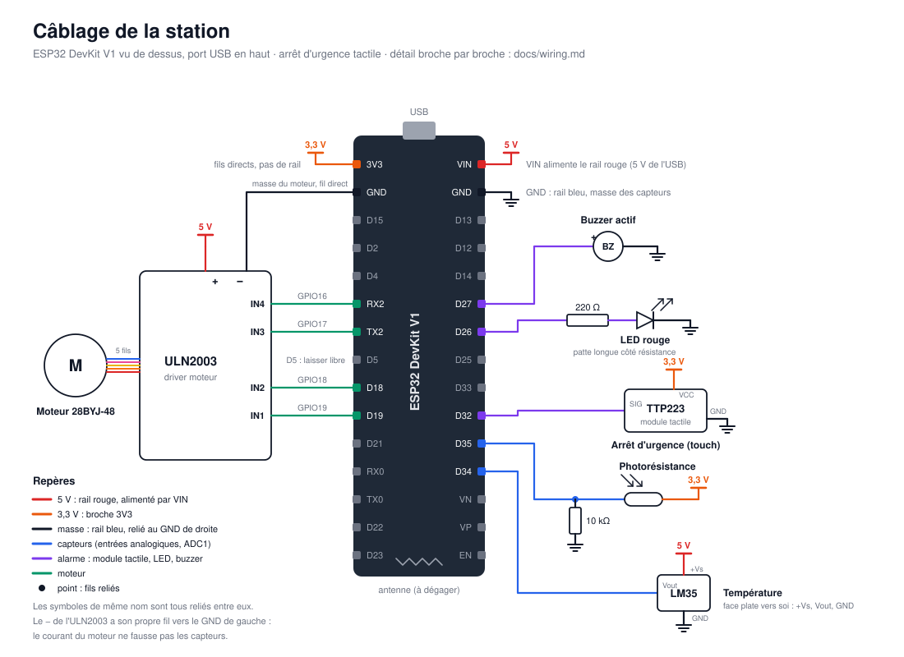

# Câblage

Branchement broche par broche de la station, avec les points d'attention
(tensions, résistances). Les numéros de GPIO de ce document et ceux de
[`include/pins.h`](../include/pins.h) doivent toujours être identiques.



Sur le schéma, les alimentations sont dessinées avec des symboles plutôt
qu'avec des fils : tous les « 5 V » sont reliés (rail rouge), tous les « 3,3 V »
aussi (broche 3V3), et toutes les masses (rail bleu). Seule exception, le fil de
masse du moteur, dessiné en entier parce qu'il est volontairement séparé.

## Carte

ESP32 DevKit V1, 30 broches (module ESP32-WROOM-32). Les noms ci-dessous sont
ceux sérigraphiés sur la carte. **TX2** et **RX2** sont les GPIO17 et GPIO16 :
ces noms viennent d'un second port série inutilisé, on s'en sert comme broches
normales.

La carte est à cheval sur deux breadboards : une colonne de broches sur chacune,
pour garder des trous libres des deux côtés.

## Règles valables pour tout le montage

- **Logique en 3,3 V.** Les GPIO de l'ESP32 ne tolèrent pas le 5 V : aucun
  signal à 5 V ne doit arriver directement sur une broche.
- **Capteurs analogiques sur ADC1** (GPIO 32 à 39). L'ADC2 est inutilisable
  quand le Wi-Fi est actif.
- **GPIO 34 à 39 : entrées uniquement**, sans résistance de tirage interne.
- **Broches à éviter** : GPIO 0, 5, 12 et 15 (broches de démarrage : leur état
  au démarrage compte, et certaines envoient un signal à ce moment-là), 6 à 11
  (mémoire flash), 1 et 3 (port série USB). GPIO2 est aussi une broche de
  démarrage, mais elle ne porte que la LED intégrée.

## Alimentation

| Depuis | Vers | Rôle |
|--------|------|------|
| VIN | rail rouge | **5 V** (celui de l'USB, environ 4,7 V après la diode de la carte) |
| GND | rail bleu | masse commune |
| 3V3 | fils directs | photorésistance et module tactile |

- Le 3,3 V n'a pas de rail, exprès : avec un seul rail rouge, impossible de
  brancher par erreur un capteur 3,3 V sur le 5 V.
- Sur la grande breadboard, les rails sont **coupés au milieu** : deux ponts
  relient les deux moitiés (rouge avec rouge, bleu avec bleu).

## Étape 1 : capteurs et moteur

### Température : LM35

| Broche du LM35 | Vers | Remarque |
|----------------|------|----------|
| +Vs | rail 5 V | il lui faut au moins 4 V |
| Vout | **GPIO34** (D34) | 10 mV par °C, ne dépasse pas 1,5 V : sans danger |
| GND | rail GND | |

Sens : face plate vers soi, pattes en bas, de gauche à droite : +Vs, Vout, GND.
Monté à l'envers, il chauffe vite.

### Lumière : photorésistance

```
3V3 ── photorésistance ──┬── 10 kΩ ── GND
                         │
                    GPIO35 (D35)
```

Pont diviseur : plus il y a de lumière, plus la tension sur GPIO35 monte. La
résistance de 10 kΩ est de l'ordre de celle de la photorésistance dans une pièce
éclairée, c'est là que le montage est le plus sensible.

### Moteur : 28BYJ-48 et driver ULN2003

| Broche ESP32 | ULN2003 |
|--------------|---------|
| D19 (GPIO19) | IN1 |
| D18 (GPIO18) | IN2 |
| TX2 (GPIO17) | IN3 |
| RX2 (GPIO16) | IN4 |
| rail 5 V | + (5-12V) |
| **GND côté gauche de l'ESP32** (sous 3V3), fil direct | − |

- **Masse du moteur à part.** Le − de l'ULN2003 ne passe pas par le rail GND
  des capteurs : il a son propre fil jusqu'à la broche GND libre de l'ESP32.
  Branché sur le rail, le courant du moteur (environ 200 mA) traversait les
  contacts de la breadboard et décalait la masse des capteurs de quelques
  dizaines de millivolts : la température gagnait 2 à 3 °C dès que le moteur
  tournait.
- **D5 reste libre** même si elle est entre D18 et TX2 : elle envoie un signal
  au démarrage qui ferait tressauter le moteur.
- **Diagnostic avec les LED A à D** de la carte ULN2003 (A = IN1 … D = IN4) :
  pendant les pauses du moteur, le programme met les 4 entrées à 0, donc les
  4 LED doivent être éteintes. Une LED qui reste allumée veut dire que son fil
  n'est pas sur la bonne broche de l'ESP32. Le moteur vibre alors sans tourner.
- L'ULN2003 accepte les signaux 3,3 V de l'ESP32 et ne renvoie jamais de 5 V
  vers elles.
- Le moteur se branche sur le connecteur blanc de la carte ULN2003 (il ne rentre
  que dans un sens).
- Le moteur consomme environ 200 mA sur le 5 V de l'USB. Si la carte redémarre
  quand il démarre, l'alimenter par le module d'alimentation 3,3 V/5 V du kit,
  masse commune avec l'ESP32.

## Étape 2 : alarme

### LED rouge

```
D26 ── résistance 220 Ω ── patte longue LED   patte courte ── rail GND
```

Environ 6 mA : (3,3 V − 2 V de la LED) / 220 Ω.

### Buzzer actif

| Patte du buzzer | Vers |
|-----------------|------|
| + (longue) | **D27** (GPIO27) |
| − (courte) | rail GND |

Le buzzer du kit est prévu pour 5 V, et le kit n'a pas de transistor pour le
commander sous 5 V. Testé directement sur le 3,3 V, il sonne assez fort : il est
donc branché en direct sur la broche, qui fournit son courant. Il sonne un peu
moins fort que sur le 3V3, la broche ne fournissant pas tout à fait autant.

D26 et D27 ne sont pas des broches de démarrage et n'envoient rien au boot :
pas de bip ni de flash parasite à l'allumage.

### Arrêt d'urgence : module tactile TTP223

Il remplace le capteur de flamme de l'étape 1, abandonné : en plein jour, il ne
distinguait pas une flamme de la lumière du soleil
([décision 0008](decisions/0008-arret-urgence-tactile.md)).

| Broche du module | Vers | Remarque |
|------------------|------|----------|
| VCC | **3V3** | **pas le 5 V** : la sortie SIG sortirait du 5 V |
| GND | rail GND | |
| SIG | **D32** (GPIO32) | à l'état haut tant qu'on touche la pastille |

- Le module fonctionne de 2 à 5,5 V ; alimenté en 3,3 V, sa sortie est
  compatible avec l'ESP32. Sa petite LED s'allume quand on le touche.
- Il se calibre à la mise sous tension : **ne pas toucher la pastille** pendant
  la première seconde.
- Le front montant de SIG déclenche une interruption matérielle. Une résistance
  de tirage interne vers la masse garde l'entrée à 0 si le module est débranché.

## Récapitulatif

| Élément | GPIO | Nom sur la carte | Étape |
|---------|------|------------------|-------|
| LED intégrée | 2 | — | 0 |
| LM35 | 34 | D34 | 1 |
| Photorésistance | 35 | D35 | 1 |
| ULN2003 IN1 | 19 | D19 | 1 |
| ULN2003 IN2 | 18 | D18 | 1 |
| ULN2003 IN3 | 17 | TX2 | 1 |
| ULN2003 IN4 | 16 | RX2 | 1 |
| LED d'alarme | 26 | D26 | 2 |
| Buzzer | 27 | D27 | 2 |
| Module tactile (arrêt d'urgence) | 32 | D32 | après l'étape 3 |
